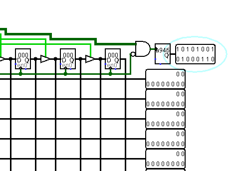
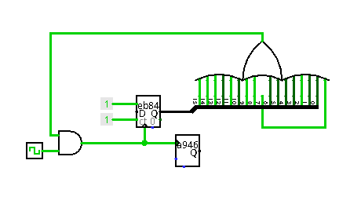

Des tetrominos qui choient
===

Sereinement, vous buvez un thé chaud de grande qualité provenant d'une machine récemment acquise. Soudainement ce moment de paisible bonheur se fit troubler par se fieffé coquin de Jean-Paul SAT. Il vous aperçoit, se dirige vers vous, et vous lance :

« Tu peux venir avec moi ? J'ai quelque chose à te montrer. Tu as réussi une de mes épreuves, ce que je vais te montrer devrais te plaire. »
Vous avalez une dernière gorgée de votre thé avant de le suivre. Vous marchez dans ses pas jusqu'à une petite pièce reculée éclairée par une chaleureuse lampe. Au fond, une borne d'arcade est fièrement disposée. D'une voix fière, Jean-Paul SAT vous lance :

« Je te présente ma borne d'arcade ! Personne dans ce café ne souhaite y jouer, ils prétendent que cela les détournerait de leurs écrits. Mais bon, une petit partie ne peux pas faire de mal, n'est ce pas ? Tu ne veux pas jouer ? »
La présence d'un tel objet dans un lieu si charmant vous intrigue, vous vous en rapprochez pour satisfaire votre curiosité.

« Tu sais, je vais te motiver ! Si tu fais pile 9999 points, je te récompenserai ! »
Vous avez à peine le temps de vous retourner que le son d'une porte qui se verrouille atteint vos oreilles, suivis des paroles suivantes : « Par récompense, j'entends la clef ! Bonne chance à toi ! »

Faire 9999 points à un jeu, ça ne va pas être si dur. C'est parti !

Fichier : Arcade.circ

Solution
===

Comme dans l'intro le fichier .circ s'ouvre avec logisim. Et comme le laisse supposer le titre, il s'agit d'un clone de Tetris.

Lacascade
---

On retrouve un écran aux proportions caractéristiques, un afficheur 4*7 segments pour le score, 4 boutons pour contrôler le jeu, et un bouton pour lancer le jeu. Un premier circuit, nommé « Verlaine », est situé juste en dessous du score, et un deuxième nommé « Jean paul SAT » est positionné à gauche, et sur lequel est connecté tout le reste (boutons et écran).

Avant d'aller plus loin, il est temps de jouer! On suit les instructions : fréquence d'horloge, démarrage de l'horloge avec ctrl-K, et un appui suffisamment long sur le bouton Start. On peut alors tester les 4 autres boutons : les deux du haut permettent de faire tourner le _tetromino qui choit_, dans le sens horaire pour celui de droite, et dans l'autre pour celui de gauche. Les deux du bas déplacent la pièce, à gauche pour celui de gauche, et à droite pour celui de droite. Au moins, les contrôles sont intuitifs. On peut alors tenter de faire une première ligne, et on voit le score passer à 0005. 5 points par lignes, OK. Une deuxième ligne? Le score passe à 000A!

0x000A, le score est donc en hexadécimal. Mais alors, doit-on faire 9999 / 0x270f ou bien 39321 / 0x9999 ? On va vite le découvrir... On peut mettre le jeu en pause, en figeant l'horloge avec ctrl-K, pour analyser un peu tout ça, et plonger dans les entrailles de Verlaine et Jean Paul.

Commençons par le premier :

Verlaine
---

Rien de très intéressant dans ce circuit : juste quelques connexions, mais aucun composant. Un bus 16 bits en entrée est séparé en 4 bus de 4 bits en sortie, alimentant chacun un des 4 afficheurs 7 segments. Clairement, c'est dans l'autre circuit que tout va se jouer! 

Jean Paul SAT
---

Sur ce circuit, on distingue tout à droite les sorties qui alimentent l'écran, où chaque bus de 10 bits contrôle une ligne horizontale de 10 pixels. Ces sorties sont des lignes numérotées, que l'on retrouve juste à droite du grand composant central, le 3ème en partant de la gauche, et survolé par 5 connexions verticales. Celui-ci s'appelle « Molière ». Ces mêmes sorties sont également réutilisées en entrée du composant tout à gauche baptisé « Rimbaud ». Juste à gauche des sorties (donc à droite), on retrouve le bus de sortie 16 bits, qui doit correspondre au score. Ce bus sort d'un sous-composant baptisé « Flaubert ». On retrouve en bas les 4 entrées correspondant aux boutons, qui entrent dans un autre sous-composant nommé « Zola », ainsi que l'entrée du bouton Start, qui alimente « Corneille ». Corneille ne sert probablement qu'à propager l'horloge aux différents circuits, une fois que le bouton Start est pressé. Penchons-nous plutôt sur Flaubert et Zola. Et d'abord Flaubert, qui semble en rapport direct avec la gestion du score.

Flaubert
---

On retrouve tout d'abord le bus de sortie, qui est censé contenir le score. Juste avant de ressortir, ce bus part sur la grande porte ET, dont certaines entrées sont inversées. Ainsi, pour activer la porte, il faut activer les bits 0,3,4,7,8,11,12 et 15, et désactiver les bits 1,2,5,6,9,10,13 et 14 du score. Ce qui donne une valeur de score de 0x9999, soit 39321. C'est vraisemblablement cette porte qui déclenchera la révélation du flag. On remarque aussi que le score est stocké dans un composant "registre", sont la sortie est rebouclée sur l'entrée en passant par un additionneur. Le registre contient le score, l'additionneur prépare le score suivant, et quand l'entrée `enable` devient active, une pulsation d'horloge affecte ce nouveau score au registre.

Petite question subsidiaire au passage : 39321 n'est pas divisible par 5... Comment atteindre ce score? Rien de plus simple, il suffit de faire plusieurs fois le tout du compteur! Il faudra donc en réalité atteindre le score de 0x49999, soit 301465 points.

Avant d'entrer dans les entrailles de Zola, on peut suivre un peu les connexions de Flaubert sur le schéma de Jean Paul SAT : (on compte les connexions dans le sens inverse des aiguilles d'une montre, en partant du repère)

Pour repérer les correspondances entre l'extérieur et l'intérieur d'un composant, on peut utiliser l'éditeur d'apparance.

 - 1 : Reliée à l'entrée `enable` du registre. C'est elle qui va contrôler l'incrémentation du score. Elle semble provenir de l'un des deux grands composant à gauche (« Rimbaud » et « Baudelaire »), mais elle alimente également une porte ET dont la sortie incrémente un compteur. Visiblement, on a également un compteur de lignes en interne, qui n'est pas affiché sur la vue principale.
 - 2 : L'horloge du registre, elle sort de Corneille, le distributeur d'horloge... normal!
 - 3 : Le `reset` du registre. Il sort de Corneille, et se déclenche probablement lors de l'appui sur Start, pour mettre le score à 0.
 - 4 : La retenue de l'additionneur. Si on doit faire 4 fois le tour du compteur, elle devra se déclencher 4 fois.
 - 5 : La sortie de la grande porte, qui s'active sur le score 9999. Elle part dans une autre porte ET, à 3 entrées, 
 - 6 : C'est le score, on l'a déjà vu...

Petite expérience : et si on changeait directement le compteur du score en 9999?

On reset le jeu avec ctrl-R, on relance l'horloge avec ctrl-K, on lance une partie en maintenant Start, puis on met en pause avec ctrl-K. On va passer en mode « Hiérarchie », qui est un peu plus parlant que le mode liste, dans le panneau de gauche. On peut alors naviguer dans les différents circuits. En mode liste, on voit les composants définis, alors qu'en mode hiérarchie on voit leur instanciation dans le composant parent. Si on ouvre flaubert, qu'on clique sur le registre, il s'encadre de rouge et on peut saisir une nouvelle valeure : 9999. On peut retourner dans Lacascade pour visualiser l'effet. Avant même d'enlever la pause, on peut constater 2 effets :

 - Le score est passé à 9999
 - La pièce qui était en train de tomber n'est plus la même, et elle a wrappé entre les 2 bords de l'écran

Manifestement il se passe quelque chose. Ctrl-K pour refaire battre son coeur... Mais plus rien de marche. On peut renouveler l'expérience, les effets ne sont pas toujours les mêmes. On peut voir les pièces posées descendre alors que les lignes ne sont pas complètes, on peut voir la pièce en chute se métamorphoser, ou encore voir descendre des nouvelles pièces alors que d'autres ne sont pas encore posées. Ou encore, il ne se passe rien d'anormal et le jeu continue. On a bien un mode « affichage du flag » mais qui ne fonctionne pas normalement.

Il est temps de voir ce qui se passe dans Zola. En effet, c'est là que la porte ET qui recueille le test du score à 9999, envoie sa sortie.

Zola
---

Beaucoup de choses interressantes! Un ROM mystérieuse, beaucoup de multiplexeurs, et quelques portes logiques. En entrée à gauche, on retrouve les 4 boutons de jeu. En sortie à droite, on retrouve les 4 boutons de jeu. Mais entre les deux, un multiplexeur semble choisir ce qui sort : les vrais boutons, ou quelque chose qui sort de la ROM mystérieuse. On a bien là le genre de circuit qui va modifier le comportement du jeu. L'affichage du flag serait-il par là? En sortie de la ROM, on a une porte XOR multiple : 8 bits de ROM ^ 8 bits d'une entrée baptisée `Key`. On a donc une clé à trouver pour décoder la ROM. Le déclenchement du mode avec une mauvaise clé va générer des évenements qui ne sont pas les bons, et au lieu du flag, on a du bug, on a le _flug_. La clé est sur 16 bits, un multiplexeur chosit les 8 bits de poids fort ou faible suivant les différents bits du score qui sont énumérés... Mais quelle est la valeur de la clé?

Retour sur Jean Paul SAT pour voir d'où elle sort. Il s'agit de la connexion 17 de Zola (dernière avant de revenir sur le repère), et elle arrive de la porte XOR qui prend sur l'une de ses entrées la valeur du compteur de lignes. Il va donc falloir calculer le nombre de lignes à faire. Sachant que le score à atteindre est 301465 et qu'on obtient 5 points par ligne, il faut faire 301465/5 = 60293 lignes, soit EB85 en hexadécimal. Mais l'autre entrée de la porte, elle vient d'où? Elle arrive de Rimbaud, le grand composant vertical tout à gauche, et c'est sa sortie tout en bas à droite. Allons lui rendre visite!

Rimbaud
---

Il fait se déplacer tout en haut à droite, pour retrouver la sortie correpondante. Elle est générée par... un Random! Heureusement, que rien n'est vraiment random ici... D'ailleurs, on a un `seed` dans les paramètres du bloc. On le voit en décimal à gauche, et en hexa sur le bloc après un reset (ctrl-R).

La question est donc de savoir combien de valeurs vont être générées avant que la bonne ne soit sortie. La génération des randoms se déclenche sur la sortie d'une porte ET, dont l'une des entrées est facilement reconnaissable. C'est la pin 54 (dernière avant de revenir sur le repère), et sur Jean Paul SAT, c'est la ligne qui déclenche l'incrémentation du compteur de lignes, et du score. L'autre entrée du ET, qui est inversée, c'est la ligne d'horloge, qui permet donc déclencher le random sur les fronts descendants. En résumé, la valeur qu'on cherche à entrer dans le XOR avec le compteur de ligne, c'est le 60293ème random du générateur dont on connait le `seed`. Voyons... on a un simulateur sous la main... et si on le simulait?

Simulation du Random
---

Fichier... Nouveau... Un compteur, un bloc random, une porte OU pour désactiver l'horloge quand le compteur arrive à 0... Le tout sur 16 bits, la bonne valeur de seed, on reset, on positionne le compteurà EB85, et on peut lancer la simulation. D'abord un ctrl-T (`tick`) pour vérifier que tout se passe bien, puis on peut lancer l'horloge avec ctrl-K. Si on reste sur une fréquence d'horloge identique au jeu, on va y passer quelques heures, alors on va accélérer les choses! A la fréquence max, en quelques secondes, le compteur arrive à 0, et on a notre valeure magique : 38c2. Quant à la clé `Key`, elle va donc prendre la valeur 0x38c2 ^ 0xeb85 = 0xd347. D'ailleurs, la ROM de Zola commençait par D3 46 46 D2 D2 46 46 D2.... soit une fois décodée avec la `Key` : 00 01 01 01 01 01 01 01...

Retour sur le jeu, avec cette valeure en tête. Rappel : on doit faire 9999 points, EB85 lignes, et 38C2 au random.

Le flag!
---

Petit problème, en entrant le nombre EB85 sur le compteur de lignes, ce nombre part dans « Volataire » et déclenche une ligne qui inhibe notre porte ET. Il doit s'agir d'une protection contre la modification sauvage de ce compteur... 

Mais ça ne nous arrête pas : on n'a pas besoin d'avoir EB85 dans ce compteur, mais seulement D347 en sortie du XOR qui se trouve dans Zola. Vu que la protection ne se déclenche pas à 0 lignes, on va simplement faire sortir D347 du bloc random caché dans Rimbaud.

On va donc aller modifier un peu Rimbaud, et changer la valeur `Seed` dans les paramètres du bloc : 54087 (soit D347 en hexa). Un petit ctrl-R pour vérifier que la valeur est bien prise en compte sur le bloc. Maintenant, on peut lancer une partie tout neuve, mettre en pause, modifier le score dans le registre à l'intérieur de Flaubert, et regarder le resultat sur le circuit principal. Plus rien? On enlève la pause... Toujours rien... Quelque chose ne va pas? ... toujours rien... Pause, direction Zola... On voit que la ROM n'est plus dans la position initiale, mais qu'on est toujours dans la séquence D2 46 46 D2... Et si c'était normal? Après tout, il s'agit sûrement d'une séquence permettant de nettoyer l'écran, mais vu que notre écran est déjà vide... Retour sur l'écran principal, on enlève la pause, et avec un peu plus de patience, des pièces commencent à tomber...

